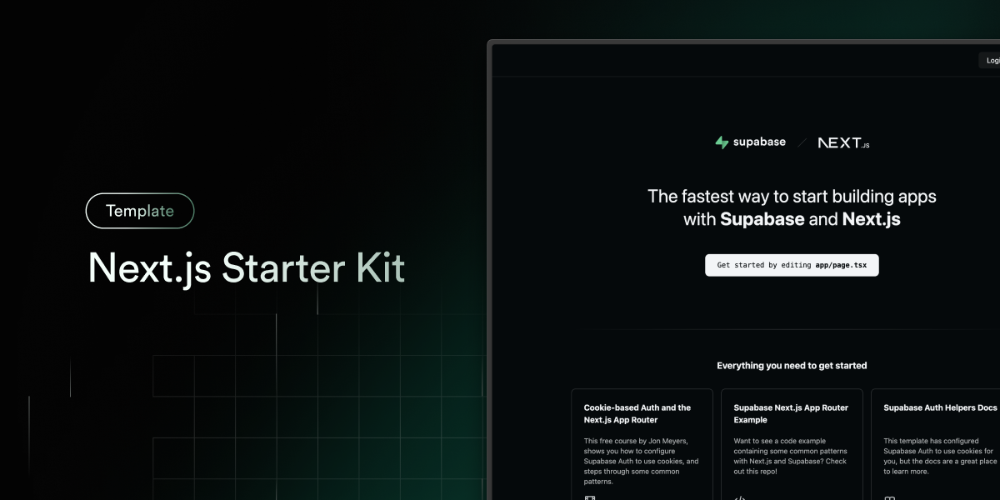

<p align="center">
  
</p>

<h1 align="center">🚀 MattyJacks.com — Official Website</h1>

<p align="center">
  <strong>We'll make you money and/or DIE TRYING!!!</strong>
</p>

<p align="center">
  <em>Outsourcing · Websites · Sales · Consulting · Software · Custom AI · Elite Freelancers · Idea-to-Income Execution</em>
</p>

<p align="center">
  <a href="https://mattyjacks.com">🌐 Live Site</a> · 
  <a href="https://mattyjacks.com/contact">📬 Contact</a> · 
  <a href="https://mattyjacks.com/services">🛠️ Services</a> · 
  <a href="https://mattyjacks.com/merchants">💳 Merchant Services</a> · 
  <a href="https://mattyjacks.com/leads">📊 Leads</a>
</p>

---

## 📋 Table of Contents

- [About the Project](#-about-the-project)
- [Live Website](#-live-website)
- [Tech Stack](#-tech-stack)
- [Project Structure](#-project-structure)
- [Pages & Routes](#-pages--routes)
  - [Home Page](#-home-page--)
  - [Services Page](#-services-page--services)
  - [Contact Page](#-contact-page--contact)
  - [Merchant Services Page](#-merchant-services-page--merchants)
  - [Leads Page](#-leads-page--leads)
  - [Resume Sites Page](#-resume-sites-page--resumes)
  - [Blog / Posts Page](#-blog--posts-page--posts)
  - [WhatsApp Page](#-whatsapp-page--whatsapp)
  - [Privacy Policy Page](#-privacy-policy-page--privacy)
  - [Authentication Pages](#-authentication-pages--auth)
  - [Protected Pages](#-protected-pages--protected)
  - [Manual Page](#-manual-page--manual)
- [Components](#-components)
  - [3D & Visual Effects](#3d--visual-effects)
  - [Navigation & Layout](#navigation--layout)
  - [Authentication Components](#authentication-components)
  - [UI Components (shadcn/ui)](#ui-components-shadcnui)
  - [Content Components](#content-components)
  - [Utility Components](#utility-components)
- [Animations & Visual Effects](#-animations--visual-effects)
- [Design System](#-design-system)
- [Authentication & Backend](#-authentication--backend)
- [SEO & Analytics](#-seo--analytics)
- [Middleware](#-middleware)
- [Getting Started](#-getting-started)
  - [Prerequisites](#prerequisites)
  - [Installation](#installation)
  - [Environment Variables](#environment-variables)
  - [Running Locally](#running-locally)
  - [Building for Production](#building-for-production)
- [Deployment](#-deployment)
- [Dependencies](#-dependencies)
- [Contact](#-contact)

---

## 🏢 About the Project

**MattyJacks.com** is the official website for MattyJacks — a business that deploys cost-effective global talent to help companies scale smarter, faster, and more efficiently. The website serves as the primary digital presence, showcasing services, portfolio work, client testimonials, lead generation databases, merchant account solutions, and more.

The site is built with cutting-edge web technologies and features:
- **Immersive 3D graphics** powered by Three.js (interactive money cube on the homepage)
- **Cinematic scroll-based animations** using GSAP and Framer Motion
- **Smooth scrolling** with Lenis for a premium feel
- **Animated cloud/space backgrounds** that change based on light/dark theme
- **Interactive emoji particle system** (💵💸) that follows the cursor on the hero section
- **Full authentication system** with Supabase (login, sign-up, password reset, protected routes)
- **Cookie consent banner** for GDPR compliance
- **Google Analytics** integration (G-LJ6LM6VMVV)
- **Responsive design** that works on all devices (mobile, tablet, desktop)
- **Dark mode & light mode** with smooth theme switching via `next-themes`
- **Automatic URL lowercasing** middleware for consistent SEO
- **www-to-non-www redirect** for canonical URL management

---

## 🌐 Live Website

The production website is live at: **[https://mattyjacks.com](https://mattyjacks.com)**

---

## 🧰 Tech Stack

| Category | Technology | Details |
|---|---|---|
| **Framework** | [Next.js 15](https://nextjs.org) | React 19, App Router, Turbopack dev server |
| **Language** | [TypeScript](https://www.typescriptlang.org) | Full type safety across the codebase |
| **Styling** | [Tailwind CSS 3.4](https://tailwindcss.com) | Utility-first CSS with custom design tokens |
| **UI Library** | [shadcn/ui](https://ui.shadcn.com) | Radix UI primitives + Tailwind styling |
| **3D Graphics** | [Three.js 0.180](https://threejs.org) | WebGL-powered 3D money cube on hero |
| **Animation** | [GSAP 3.13](https://gsap.com) | GreenSock for scroll-triggered animations |
| **Animation** | [Framer Motion 12](https://www.framer.com/motion/) | Declarative React animations |
| **Smooth Scroll** | [Lenis 1.1](https://lenis.darkroom.engineering/) | Buttery smooth page scrolling |
| **Auth & Backend** | [Supabase](https://supabase.com) | Authentication, SSR cookies, database |
| **Icons** | [Lucide React](https://lucide.dev) | 500+ clean SVG icons |
| **Icons** | [React Icons](https://react-icons.github.io/react-icons/) | Additional icon packs (e.g., Twitter/X) |
| **Markdown** | [React Markdown](https://remarkjs.github.io/react-markdown/) | Blog post rendering with GFM support |
| **Markdown** | [rehype-raw](https://github.com/rehypejs/rehype-raw) + [rehype-sanitize](https://github.com/rehypejs/rehype-sanitize) | Safe HTML in markdown |
| **Markdown** | [remark-gfm](https://github.com/remarkjs/remark-gfm) | GitHub Flavored Markdown tables, strikethrough, etc. |
| **Markdown** | [gray-matter](https://github.com/jonschlinkert/gray-matter) | YAML frontmatter parsing for blog posts |
| **Font** | [Geist](https://vercel.com/font) | Modern sans-serif from Vercel |
| **Hosting** | [Vercel](https://vercel.com) | Edge deployment with automatic SSL |
| **Analytics** | [Google Analytics 4](https://analytics.google.com) | Tracking ID: G-LJ6LM6VMVV |

---

## 📁 Project Structure

```
website-dev/
├── README.md                          # This file
├── .gitignore                         # Git ignore rules
└── mattyjacks7/                       # Main Next.js application
    ├── app/                           # Next.js App Router pages
    │   ├── layout.tsx                 # Root layout (nav, footer, theme, analytics)
    │   ├── page.tsx                   # Homepage (~814 lines of rich content)
    │   ├── globals.css                # Global styles and Tailwind directives
    │   ├── favicon.ico                # Site favicon
    │   ├── opengraph-image.png        # OG image for social sharing
    │   ├── twitter-image.png          # Twitter card image
    │   ├── auth/                      # Authentication routes
    │   │   ├── confirm/               # Email confirmation callback
    │   │   ├── error/                 # Auth error page
    │   │   ├── forgot-password/       # Password reset request
    │   │   ├── login/                 # Login page
    │   │   ├── sign-up/               # Registration page
    │   │   ├── sign-up-success/       # Post-registration success
    │   │   └── update-password/       # Password update page
    │   ├── contact/                   # Contact page
    │   ├── leads/                     # Lead generation databases
    │   ├── manual/                    # User manual / documentation
    │   ├── merchants/                 # Merchant services page
    │   ├── posts/                     # Blog system (supports yearly slugs)
    │   ├── privacy/                   # Privacy policy
    │   ├── protected/                 # Auth-gated content
    │   ├── resumes/                   # Resume website showcase
    │   ├── services/                  # Services overview page
    │   └── whatsapp/                  # WhatsApp contact page
    ├── components/                    # Reusable React components
    │   ├── animated-clouds.tsx        # Parallax cloud/space background
    │   ├── auth-button.tsx            # Auth state toggle button
    │   ├── client-theme-mount.tsx     # Client-side theme provider wrapper
    │   ├── cookie-banner.tsx          # GDPR cookie consent banner
    │   ├── deploy-button.tsx          # Vercel deploy button
    │   ├── env-var-warning.tsx        # Missing env var alert
    │   ├── forgot-password-form.tsx   # Forgot password form
    │   ├── hamburger-menu.tsx         # Mobile menu toggle
    │   ├── hero-cube.tsx              # 3D WebGL cube (Three.js)
    │   ├── hero.tsx                   # Hero section layout
    │   ├── login-form.tsx             # Login form with validation
    │   ├── logout-button.tsx          # Logout action button
    │   ├── mobile-sidebar.tsx         # Slide-out mobile navigation
    │   ├── money-cube.tsx             # 3D interactive money cube (37KB!)
    │   ├── navigation.tsx             # Top navigation bar
    │   ├── next-logo.tsx              # Next.js logo SVG
    │   ├── resume-card.tsx            # Resume portfolio card
    │   ├── resume-cta-buttons.tsx     # Resume CTA actions
    │   ├── safe-markdown.tsx          # Sanitized markdown renderer
    │   ├── scaled-iframe.tsx          # Responsive iframe embed
    │   ├── sign-up-form.tsx           # Registration form
    │   ├── smooth-scroll.tsx          # Lenis smooth scroll wrapper
    │   ├── supabase-logo.tsx          # Supabase branding SVG
    │   ├── theme-switcher.tsx         # Light/dark theme dropdown
    │   ├── theme-toggle.tsx           # Theme toggle button
    │   ├── update-password-form.tsx   # Password update form
    │   ├── worker-feedback.tsx        # Worker feedback carousel
    │   ├── tutorial/                  # Tutorial/onboarding components
    │   └── ui/                        # shadcn/ui base components
    │       ├── badge.tsx              # Badge component
    │       ├── button.tsx             # Button with variants
    │       ├── card.tsx               # Card container
    │       ├── checkbox.tsx           # Checkbox input
    │       ├── dropdown-menu.tsx      # Dropdown menu
    │       ├── input.tsx              # Text input field
    │       └── label.tsx              # Form label
    ├── lib/                           # Shared utilities and logic
    │   ├── utils.ts                   # General utility functions (cn helper)
    │   ├── posts-content.ts           # Blog post content management
    │   ├── animations/                # Animation presets
    │   │   └── scroll-animations.ts   # Scroll-triggered animation configs
    │   ├── hooks/                     # Custom React hooks
    │   │   └── useScrollAnimation.ts  # Intersection Observer hook
    │   └── supabase/                  # Supabase client configuration
    │       ├── client.ts              # Browser Supabase client
    │       ├── server.ts              # Server Supabase client
    │       └── middleware.ts          # Session management middleware
    ├── public/                        # Static assets
    │   ├── images/                    # All site images
    │   │   ├── cloud-image_*.jpg      # Cloud parallax backgrounds
    │   │   ├── seamless-space-*.jpg   # Space background (dark mode)
    │   │   ├── tristatehoney-*.jpg    # Portfolio screenshots
    │   │   ├── bg-100-dollar-*.png    # Money pattern background
    │   │   └── mattyjacks-site-logo_*.png  # Site logos
    │   └── videos/                    # Video assets
    │       └── matt-testimonial-*.mp4 # Client testimonial video
    ├── src/                           # Additional source files
    ├── middleware.ts                   # Next.js middleware (URL normalization)
    ├── next.config.ts                 # Next.js configuration
    ├── tailwind.config.ts             # Tailwind CSS configuration
    ├── tsconfig.json                  # TypeScript configuration
    ├── postcss.config.mjs             # PostCSS configuration
    ├── eslint.config.mjs              # ESLint configuration
    ├── components.json                # shadcn/ui configuration
    ├── package.json                   # Dependencies and scripts
    ├── package-lock.json              # Lockfile
    └── .env.example                   # Environment variable template
```

---

## 📄 Pages & Routes

### 🏠 Home Page (`/`)

The homepage is the most content-rich page on the site (~814 lines, 46KB). It features the following sections in order:

1. **Hero Section** — Full-screen hero with:
   - Animated parallax cloud background (light mode) / space background (dark mode)
   - Interactive **3D Money Cube** rendered with Three.js/WebGL
   - **Emoji particle system** (💵💸) that follows cursor movement on hover
   - Tagline: *"Outsourcing, Websites, Sales, Consulting, Software"*
   - Description of services and global talent deployment
   - CTA buttons: "Share Your Vision" → `/contact` and "Call Us" → `tel:+16039999420`

2. **About Section** — *"Global Talent Meets Technology"*
   - Highlights capabilities: software dev, cold calling, lead generation, graphic design, copywriting, virtual assistance
   - Scroll-triggered fade-in animations

3. **Services Grid** — 4-card animated grid:
   - 🤖 Custom AI Solutions
   - 👥 Elite Freelancers
   - 📈 Idea-to-Income
   - 🎨 Web Design

4. **Merchant Services Banner** — Full-width emerald gradient section:
   - Payment processing solutions for high-risk and low-risk businesses
   - 3 feature cards: 3 Day Approvals, High-Risk Specialists, Competitive Rates
   - Trust indicators: Secured Processing, 24/7 Support, Multiple Payment Options, Chargeback Protection
   - CTA: "Explore Merchant Services" → `/merchants`

5. **Process Section** — 4-step workflow (desktop: horizontal with connecting lines, mobile: vertical timeline):
   - Step 1: Share Your Vision
   - Step 2: Strategic Assessment
   - Step 3: Build and Execute
   - Step 4: Deliver Results

6. **Industries Section** — 8-industry grid:
   - Software & SaaS, E-commerce & DTC, Agencies & Studios, Local Services
   - Professional Services, Education & Info Products, Marketplaces, Media & Community

7. **Portfolio: TristateHoney.com** — Case study with screenshots showing real lead inquiries

8. **Portfolio: Opority.com** — Live iframe preview of client website (a web design firm that hired MattyJacks)

9. **TikTok Algorithm Mastery** — Case study: grew @eric_escobedo to 3,000+ followers in 30 days, viral video with 2,300+ likes

10. **Video Demos** — 6 embedded YouTube videos in a responsive grid

11. **Testimonials** — Video testimonial from Justin Hughes, CEO of FirebringerAI (9:16 aspect ratio)

12. **Worker Feedback Carousel** — Auto-scrolling carousel of worker feedback

13. **Final CTA** — Money-patterned background with "Ready to Make Money?" call-to-action

14. **Cookie Consent Banner** — GDPR-compliant cookie notice

---

### 🛠️ Services Page (`/services`)

Detailed breakdown of all service offerings with animated cards and scroll effects. Built with Lucide icons (Phone, Code, Palette, PenTool) and scroll-triggered grid animations.

**Services include:**
- Cold Calling & Sales Outreach
- Software Development & Web Design
- Graphic Design & Branding
- Copywriting & Content Creation
- And more

---

### 📬 Contact Page (`/contact`)

Multi-channel contact page with:
- **Phone**: Call 24/7/365
- **Email**: Matt@MattyJacks.com
- **WhatsApp**: Direct messaging link
- **Contact form** or manual inquiry options
- Interactive icons: Mail, Phone, MessageCircle, FileText, ArrowRight, CheckCircle

---

### 💳 Merchant Services Page (`/merchants`)

A comprehensive **551-line** page dedicated to payment processing solutions:
- High-risk and low-risk merchant account approvals
- 20+ banking relationships
- Interactive FAQ accordion with `ChevronDown` toggles
- Feature grid with icons: CreditCard, Shield, Zap, TrendingUp, etc.
- Industry coverage: ShoppingCart, Store, Heart, Plane, Car, Gamepad2, and more
- Trust badges: Lock, Headphones (support), DollarSign, Clock
- Scroll-triggered animations throughout (fadeInUp, slideInGrid, scaleIn)

---

### 📊 Leads Page (`/leads`)

Interactive lead generation database browser featuring:

**Lead Databases Available:**
| Database | Description | Row Count |
|---|---|---|
| USA Leads | Instagram marketing prospects with usernames, bios, followers | — |
| Cruise & Travel Companies | Travel-oriented companies and agencies | — |
| Random Scrapes 2025 | Mixed collection: trucking, tech, wine, yoga, pet, insurance, contractor leads | 1,757 |
| *And more...* | Multiple additional curated lead sheets | 30,811 – 511,970+ rows |

**Features:**
- Clickable lead cards that open a **modal preview** with embedded Google Sheets
- Summary statistics component showing total sheets, total rows, and last updated date
- Number formatting with commas for readability
- Responsive grid layout with scroll animations

---

### 📄 Resume Sites Page (`/resumes`)

Showcase of conversion-focused resume websites built by MattyJacks:

| Resume Site | URL | Description |
|---|---|---|
| relentlessjavian | [relentlessjavian.vercel.app](https://relentlessjavian.vercel.app/) | Simple, clean, focused on conversions |
| moses-resume-web | [moses-resume-web.vercel.app](https://moses-resume-web.vercel.app/) | Professional presentation with clear CTAs |
| resume-julienne | [resume-julienne.vercel.app](https://resume-julienne.vercel.app/) | Elegant layout with strong portfolio highlights |

Includes CTA section: *"Want one like these?"* with quick-action buttons.

---

### 📝 Blog / Posts Page (`/posts`)

Server-rendered blog system with:
- **Dynamic routing**: `/posts/{year}/{slug}`
- **Frontmatter support**: title, date, author, description, status via `gray-matter`
- **Markdown rendering**: React Markdown with GFM tables, strikethrough, safe HTML
- **Content management** via `lib/posts-content.ts` — posts can be marked as "listed" or "unlisted"
- **Incremental static regeneration**: `revalidate = 60` (refreshes every 60 seconds)
- Clean article layout with date, author, and description

---

### 💬 WhatsApp Page (`/whatsapp`)

Dedicated landing page for WhatsApp-based communication:
- Pre-filled WhatsApp deep link: `https://api.whatsapp.com/send?phone=15106005735`
- Custom message template with name and skills placeholder
- Twitter/X integration with `FaXTwitter` icon from react-icons
- Scroll-animated content

---

### 🔒 Privacy Policy Page (`/privacy`)

Comprehensive 350-line privacy policy with:
- Professional legal layout with Lucide icons: Shield, Lock, Eye, Database, Share2, Cookie, Globe, FileText, Mail
- Sections covering data collection, usage, sharing, cookies, and user rights
- Scroll-animated section reveals

---

### 🔐 Authentication Pages (`/auth/*`)

Full Supabase-powered authentication flow:

| Route | Purpose |
|---|---|
| `/auth/login` | Email + password login |
| `/auth/sign-up` | New user registration |
| `/auth/sign-up-success` | Post-registration confirmation |
| `/auth/forgot-password` | Password reset request |
| `/auth/update-password` | Set new password |
| `/auth/confirm` | Email verification callback |
| `/auth/error` | Authentication error display |

---

### 🛡️ Protected Pages (`/protected`)

Auth-gated content accessible only to logged-in users. Session is managed via Supabase SSR cookies through middleware.

---

### 📖 Manual Page (`/manual`)

User manual or documentation page for internal reference or onboarding.

---

## 🧱 Components

### 3D & Visual Effects

| Component | File | Description |
|---|---|---|
| **MoneyCube** | `money-cube.tsx` (37KB) | Interactive 3D cube rendered with Three.js. Displays money-themed textures, rotates on interaction. The visual centerpiece of the hero section. |
| **HeroCube** | `hero-cube.tsx` (25KB) | Additional 3D WebGL cube component with different styling/behavior. |
| **AnimatedClouds** | `animated-clouds.tsx` (9.4KB) | Parallax-scrolling cloud background with configurable speed, scale, opacity. Switches between cloud image (light mode) and space image (dark mode). |

### Navigation & Layout

| Component | File | Description |
|---|---|---|
| **Navigation** | `navigation.tsx` (5.1KB) | Responsive top navigation with desktop menu and mobile hamburger. Links to: Home, Services, Merchant Services, Resume Sites, Leads, Contact, WhatsApp, Privacy. |
| **HamburgerMenu** | `hamburger-menu.tsx` (1.7KB) | Animated hamburger icon toggle for mobile navigation. |
| **MobileSidebar** | `mobile-sidebar.tsx` (6KB) | Slide-out sidebar navigation panel for mobile viewports. |
| **SmoothScroll** | `smooth-scroll.tsx` | Lenis-powered smooth scrolling wrapper applied to the entire app. |

### Authentication Components

| Component | File | Description |
|---|---|---|
| **LoginForm** | `login-form.tsx` (3.6KB) | Email/password login with validation and error handling. |
| **SignUpForm** | `sign-up-form.tsx` (3.9KB) | User registration with form validation. |
| **ForgotPasswordForm** | `forgot-password-form.tsx` (3.7KB) | Password reset email request form. |
| **UpdatePasswordForm** | `update-password-form.tsx` (2.5KB) | New password input with confirmation. |
| **AuthButton** | `auth-button.tsx` | Toggles between login/logout based on auth state. |
| **LogoutButton** | `logout-button.tsx` | Triggers Supabase sign-out action. |

### UI Components (shadcn/ui)

Built on **Radix UI** primitives with Tailwind styling:

| Component | File | Description |
|---|---|---|
| **Button** | `ui/button.tsx` | Multi-variant button (default, destructive, outline, secondary, ghost, link) |
| **Card** | `ui/card.tsx` | Composable card: CardHeader, CardTitle, CardDescription, CardContent, CardFooter |
| **Badge** | `ui/badge.tsx` | Inline status badges |
| **Input** | `ui/input.tsx` | Styled text input field |
| **Label** | `ui/label.tsx` | Accessible form label |
| **Checkbox** | `ui/checkbox.tsx` | Radix checkbox with custom styling |
| **DropdownMenu** | `ui/dropdown-menu.tsx` | Full-featured dropdown with submenus, checkboxes, radio items |

### Content Components

| Component | File | Description |
|---|---|---|
| **WorkerFeedbackCarousel** | `worker-feedback.tsx` (5.2KB) | Auto-scrolling carousel displaying worker feedback and reviews. |
| **ResumeCard** | `resume-card.tsx` | Portfolio card for resume website showcase. |
| **ResumeCTAButtons** | `resume-cta-buttons.tsx` | Action buttons (call, email) for resume service inquiries. |
| **ScaledIframe** | `scaled-iframe.tsx` (1.6KB) | Responsive iframe that scales content to fit container (used for Opority.com live preview). |
| **SafeMarkdown** | `safe-markdown.tsx` (1.5KB) | Sanitized markdown renderer with rehype-raw and rehype-sanitize. |
| **CookieBanner** | `cookie-banner.tsx` (3.5KB) | GDPR-compliant cookie consent notification. |

### Utility Components

| Component | File | Description |
|---|---|---|
| **ClientThemeProvider** | `client-theme-mount.tsx` | Wraps theme-dependent children to prevent hydration mismatches. |
| **ThemeSwitcher** | `theme-switcher.tsx` | Dropdown menu for theme selection (light, dark, system). |
| **ThemeToggle** | `theme-toggle.tsx` | Simple theme toggle button with icon animation. |
| **DeployButton** | `deploy-button.tsx` | Vercel deploy-to-own-account button. |
| **EnvVarWarning** | `env-var-warning.tsx` | Warning banner when environment variables are missing. |

---

## ✨ Animations & Visual Effects

The site makes heavy use of animations for a premium, engaging user experience:

### Scroll-Triggered Animations (`lib/animations/scroll-animations.ts`)

Powered by a custom **Intersection Observer hook** (`lib/hooks/useScrollAnimation.ts`), elements animate into view as users scroll:

| Animation Preset | Effect |
|---|---|
| `fadeInUp` | Elements fade in and slide up from below |
| `fadeInLeft` | Elements fade in and slide in from the left |
| `slideInGrid` | Grid children stagger-animate into view |
| `scaleIn` | Elements scale up from 0 to full size |

### 3D Graphics (Three.js)

- **MoneyCube**: A fully interactive 3D cube with money-themed textures, lighting, and rotation. Responds to mouse/touch input. At **37KB**, it's one of the most complex components.
- **HeroCube**: Secondary 3D cube component (25KB) with additional visual effects.

### Emoji Particle System

The homepage hero section features a cursor-following particle system:
- Emits 💵 (bills fall down) and 💸 (fly-aways rise up) emojis
- 2–5 particles per second while hovering
- Physics-based: gravity, rotation, velocity, minimum lifetime
- Touch-compatible for mobile devices
- Automatically garbage-collected when particles leave the viewport

### Parallax Backgrounds

- **Cloud mode** (light theme): Slow-drifting clouds with vertical and horizontal parallax
- **Space mode** (dark theme): Animated space/stars background
- Configurable: opacity, speed, scale range, drift speed

### Smooth Scrolling

**Lenis** provides buttery-smooth page scrolling across the entire application, creating a polished, premium feel.

### Micro-Interactions

- Hover effects on cards: scale, shadow, border color transitions
- Button hover states with gradient reveals
- Icon animations on hover (scale, color transitions)
- Navigation transitions and mobile sidebar slide
- All transitions use `duration-200` to `duration-300` for consistent timing

---

## 🎨 Design System

### Color Palette

| Usage | Light Mode | Dark Mode |
|---|---|---|
| **Primary** | Emerald 600 (`#059669`) | Emerald 300–400 |
| **Accent** | Red 600 (`#dc2626`) | Red 400–500 |
| **Background** | White / Zinc 50 | Zinc 950 / Zinc 900 |
| **Text** | Zinc 900 / Zinc 700 | Zinc 100 / Zinc 300 |
| **Borders** | Zinc 200 | Zinc 800 |
| **Hover States** | Red highlights | Red highlights |

### Typography

- **Primary Font**: Geist Sans (from Vercel) — modern, clean sans-serif
- **Font loading**: `next/font/google` with `display: "swap"` for optimal performance
- **Scale**: Responsive text sizing from `text-xs` to `text-7xl`
- **Tracking**: Ultra-wide tracking (`tracking-[0.2em]`, `tracking-[0.25em]`) for section labels

### Theme System

- Powered by `next-themes` with `ThemeProvider`
- Default theme: **dark**
- Supports: `light`, `dark`, `system`
- `disableTransitionOnChange` prevents FOUC during theme switch
- `suppressHydrationWarning` on `<html>` for SSR compatibility

---

## 🔑 Authentication & Backend

### Supabase Integration

The application uses **Supabase** for authentication and backend services:

- **Client-side**: `lib/supabase/client.ts` — Browser Supabase client for client components
- **Server-side**: `lib/supabase/server.ts` — Server Supabase client for server components and API routes
- **Middleware**: `lib/supabase/middleware.ts` — Session refresh and cookie management
- **SSR Cookies**: `@supabase/ssr` package handles cookie-based sessions across the full Next.js stack

### Authentication Features

- Email + password sign-up and login
- Password reset via email
- Email confirmation flow
- Protected routes (e.g., `/protected`)
- Auth state management across client and server
- Automatic session refresh in middleware

---

## 📈 SEO & Analytics

### SEO

- **Meta tags**: Title, description, and Open Graph metadata defined in `layout.tsx`
- **Title**: *"MattyJacks - We'll make you money and/or DIE TRYING!!!"*
- **Description**: *"Outsourcing, Websites, Sales, Consulting, Software, Custom AI, elite freelancers, idea-to-income execution, and web design that converts."*
- **Open Graph image**: Custom branded image at `/images/mattyjacks-site-logo_upscayl_3x_digital-art-4x.png`
- **Twitter card image**: Same as OG image
- **URL canonicalization**: `www.mattyjacks.com` → `mattyjacks.com` redirect
- **URL normalization**: Middleware forces all URLs to lowercase with 301 redirects

### Google Analytics 4

- **Tracking ID**: `G-LJ6LM6VMVV`
- Loaded via `next/script` with `strategy="beforeInteractive"` for early loading
- Standard `gtag.js` implementation

---

## 🔄 Middleware

The application includes Next.js middleware (`middleware.ts`) that handles:

1. **URL Lowercasing**: Any URL with uppercase characters is 301-redirected to its lowercase equivalent for consistent SEO
2. **Session Management**: Supabase session cookies are refreshed on every request via `updateSession()`

**Matcher**: All routes except static files, images, and Next.js internals.

---

## 🚀 Getting Started

### Prerequisites

- **Node.js** 18+ (recommended: 20+)
- **npm**, **yarn**, or **pnpm**
- A **Supabase** project ([create one here](https://database.new))

### Installation

1. Clone the repository:

   ```bash
   git clone https://github.com/mattyjacks/website.git
   cd website/mattyjacks7
   ```

2. Install dependencies:

   ```bash
   npm install
   ```

### Environment Variables

Create a `.env.local` file in the `mattyjacks7/` directory (or copy `.env.example`):

```bash
cp .env.example .env.local
```

Required variables:

```env
# Supabase Configuration
NEXT_PUBLIC_SUPABASE_URL=your-project-url
NEXT_PUBLIC_SUPABASE_PUBLISHABLE_OR_ANON_KEY=your-anon-key
```

You can find these values in your [Supabase project API settings](https://supabase.com/dashboard/project/_?showConnect=true).

### Running Locally

Start the development server with Turbopack:

```bash
npm run dev
```

The site will be available at **[http://localhost:3000](http://localhost:3000)**.

### Building for Production

```bash
npm run build
npm start
```

### Linting

```bash
npm run lint
```

---

## 🌍 Deployment

The site is deployed on **Vercel** with the following configuration:

- **Framework Preset**: Next.js
- **Root Directory**: `mattyjacks7`
- **Build Command**: `next build`
- **Output Directory**: `.next`
- **Custom Domain**: `mattyjacks.com`
- **Redirect**: `www.mattyjacks.com` → `mattyjacks.com` (configured in `next.config.ts`)
- **SSL**: Automatic via Vercel
- **CDN**: Global edge network

### Vercel Integration with Supabase

When deploying via the Vercel button, the Supabase integration automatically provisions environment variables to the Vercel project.

---

## 📦 Dependencies

### Production Dependencies

| Package | Version | Purpose |
|---|---|---|
| `next` | ^15.5.9 | React framework with App Router |
| `react` | ^19.0.0 | UI library |
| `react-dom` | ^19.0.0 | React DOM rendering |
| `three` | ^0.180.0 | 3D WebGL graphics engine |
| `gsap` | ^3.13.0 | GreenSock Animation Platform |
| `@gsap/react` | ^2.1.2 | GSAP React integration |
| `framer-motion` | ^12.23.22 | Declarative animations for React |
| `lenis` | ^1.1.19 | Smooth scroll library |
| `@supabase/supabase-js` | latest | Supabase JavaScript client |
| `@supabase/ssr` | latest | Supabase SSR helpers |
| `next-themes` | ^0.4.6 | Theme management |
| `lucide-react` | ^0.511.0 | Icon library |
| `react-icons` | ^5.5.0 | Additional icon packs |
| `react-markdown` | ^10.1.0 | Markdown rendering |
| `rehype-raw` | ^7.0.0 | HTML in markdown |
| `rehype-sanitize` | ^6.0.0 | Sanitize HTML |
| `remark-gfm` | ^4.0.1 | GitHub Flavored Markdown |
| `gray-matter` | ^4.0.3 | YAML frontmatter parser |
| `class-variance-authority` | ^0.7.1 | Component variant management |
| `clsx` | ^2.1.1 | Conditional CSS classes |
| `tailwind-merge` | ^3.3.0 | Merge Tailwind classes |
| `@radix-ui/react-checkbox` | ^1.3.1 | Accessible checkbox |
| `@radix-ui/react-dropdown-menu` | ^2.1.14 | Accessible dropdown |
| `@radix-ui/react-label` | ^2.1.6 | Accessible label |
| `@radix-ui/react-slot` | ^1.2.2 | Slot composition pattern |

### Dev Dependencies

| Package | Version | Purpose |
|---|---|---|
| `typescript` | ^5 | Type safety |
| `@types/node` | ^20.19.17 | Node.js type definitions |
| `@types/react` | ^19 | React type definitions |
| `@types/react-dom` | ^19 | React DOM type defs |
| `@types/three` | ^0.180.0 | Three.js type definitions |
| `tailwindcss` | ^3.4.1 | Utility-first CSS framework |
| `tailwindcss-animate` | ^1.0.7 | Tailwind animation plugin |
| `autoprefixer` | ^10.4.20 | CSS vendor prefixing |
| `postcss` | ^8 | CSS processing |
| `eslint` | ^9 | JavaScript linting |
| `eslint-config-next` | 15.3.1 | Next.js ESLint rules |
| `@eslint/eslintrc` | ^3 | ESLint config toolkit |

---

## 📞 Contact

| Channel | Details |
|---|---|
| **Website** | [mattyjacks.com](https://mattyjacks.com) |
| **Email** | [Matt@MattyJacks.com](mailto:Matt@MattyJacks.com) |
| **Phone** | [603-999-9420](tel:+16039999420) — Available 24/7/365 |
| **WhatsApp** | [Send a message](https://api.whatsapp.com/send?phone=15106005735) |

---

<p align="center">
  <strong>© 2025 MattyJacks. All rights reserved.</strong><br />
  <em>We'll make you money and/or DIE TRYING!!!</em>
</p>
